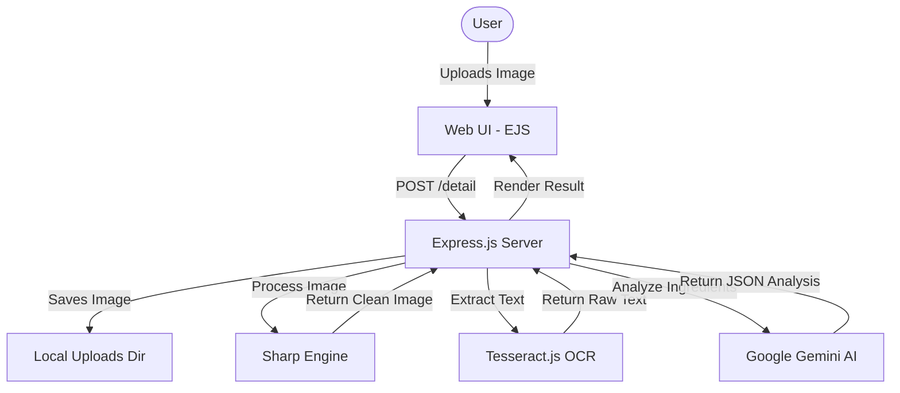

# ANUGYA System Architecture

This document describes the high-level architecture and data flow of the ANUGYA food ingredient scanner application.

## 🏗️ High-Level Overview

ANUGYA is built using an event-driven, monolithic architecture. It leverages modern web technologies and AI services to provide real-time analysis of food products.

## ⚙️ Components

### 1. Frontend (Web UI)
- **Engine**: EJS (Embedded JavaScript) templates.
- **Styling**: Vanilla CSS with a focus on glassmorphic and modern aesthetics.
- **Interaction**: Client-side JavaScript for handling file uploads, mood selection, and chemical analysis requests.

### 2. Backend (Express.js Server)
- **Role**: Handles routing, file uploads, image preprocessing, and orchestration between OCR and AI services.
- **Key Modules**:
  - `server.js`: Central logic for all application routes and service integrations.
  - `multer`: Middleware for handling multipart/form-data (image uploads).

### 3. OCR Pipeline
- **Sharp**: Preprocesses the uploaded image (grayscale, normalization, thresholding) to optimize it for text recognition.
- **Tesseract.js**: Performs Optical Character Recognition (OCR) on the preprocessed image to extract raw ingredient text.

### 4. AI Analysis Engine
- **Service**: Google Gemini 1.5 Flash.
- **Mechanism**: The backend sends the extracted text to Gemini with a specialized prompt.
- **Output**: Gemini returns a structured JSON response containing:
  - Product safety assessment.
  - Health rating and score.
  - Identification of harmful chemicals.
  - Consumption recommendations.

## 🔄 Data Flow

1.  **Upload Phase**: User submits an image via the `/upload` route.
2.  **Storage Phase**: `multer` saves the image to `public/uploads/`.
3.  **Preprocessing Phase**: `sharp` cleans the image, increasing contrast and removing noise.
4.  **Extraction Phase**: `tesseract.js` scans the cleaned image for text.
5.  **Analysis Phase**: Raw text is sent to Gemini AI for intelligent ingredient analysis.
6.  **Response Phase**: The server parses the AI's JSON response and renders the `detail` view with the results.

## 🛠️ Environment Configuration

The system requires a `.env` file containing:
- `GEMINI_API_KEY`: Authentication for Google Generative AI services.
